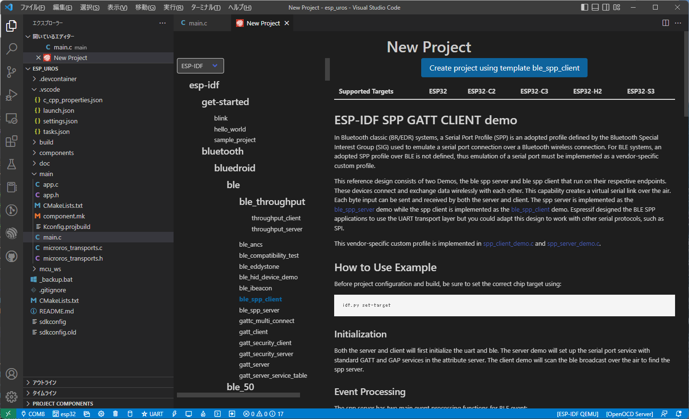

# micro-ROSの調査

## 動作確認バージョン

- ROS2 : Humble

## 作業環境

ビルド環境は下記を用意した。

1. Ubuntu PC : Ubuntu 22.04 64bitをインストールしたPC環境

    micro-ROSをビルドし、libmicroros.aや*.hをビルドする環境

2. Windows PC

    TOPPERS/ASP3やサンプルアプリをビルドする環境

3. Raspberry Pi : Raspberry Pi 3B+にUbuntu 22.04 64bitをインストールした環境

    エージェント（`Micro-XRCE-DDS-Agent`）を実行し、USBシリアルでターゲットボードと通信

## Ubuntu PC の環境設定

### micro-ROS開発環境の構築

micro-ROSをビルドしない場合は、11.の手順から行う。

0. 前準備 : ビルドを高速化するために以下を設定。NUMには並列コンパイルの数を記載する。

    ```bash
    export MAKEFLAGS="-j NUM"
    ```

1. ロケールを設定するため、以下のコマンドを実行する。

    ```bash
    sudo apt update && sudo apt -y install locales
    sudo locale-gen en_US en_US.UTF-8
    sudo update-locale LC_ALL=en_US.UTF-8 LANG=en_US.UTF-8
    export LANG=en_US.UTF-8
    ```

2. GPGキーを設定する。以下のコマンドを実行する

    ```bash
    sudo apt update && sudo apt -y install curl gnupg2 lsb-release
    sudo curl -sSL https://raw.githubusercontent.com/ros/rosdistro/master/ros.key -o /usr/share/keyrings/ros-archive-keyring.gpg
    ```

3. リポジトリをソースリストに追加する。以下のコマンドを実行する

    ```bash
    sudo echo "deb [arch=$(dpkg --print-architecture) signed-by=/usr/share/keyrings/ros-archive-keyring.gpg] http://packages.ros.org/ros2/ubuntu $(source /etc/os-release && echo $UBUNTU_CODENAME) main" | sudo tee /etc/apt/sources.list.d/ros2.list > /dev/null
    ```

4. ROS2パッケージをインストールする。以下のコマンドを実行する

    ```bash
    sudo apt update; sudo apt -y install ros-humble-ros-base
    ```

    rviz2等をインストールする場合は以下もインストール．

    ```bash
    sudo apt install ros-humble-desktop
    ```

    ```bash
    source /opt/ros/humble/setup.bash
    ```

5. micro-ROSをインストールするため、以下のコマンドを実行する。

    ```bash
    sudo apt update
    sudo apt install -y python3-pip python3-nose clang-format pyflakes3 python3-mypy python3-pytest-mock gperf ros-$ROS_DISTRO-osrf-testing-tools-cpp python3-lttng ros-$ROS_DISTRO-mimick-vendor python3-babeltrace python3-rosdep2 python3-colcon-common-extensions
    export CROSS_COMPILE=/usr/bin/arm-none-eabi-
    export TOOLCHAIN_PREFIX=/usr/bin/arm-none-eabi-
    ```

6. ビルドに必要な準備を行うため、以下のコマンドを実行する。

    ```bash
    mkdir uros_ws
    cd uros_ws    
    git clone -b $ROS_DISTRO https://github.com/micro-ROS/micro_ros_setup.git src/micro_ros_setup
    rosdep update && rosdep install --from-path src --ignore-src -y
    colcon build
    source install/local_setup.bash
    cd ..
    ```

7. micro_ros_espidf_componentをgitからクローンする。以下のコマンドを実行する。

   ```bash
   # pip install pyyaml catkin_pkg
   git clone -b $ROS_DISTRO https://github.com/micro-ROS/micro_ros_espidf_component.git
   ```

8. micro-ROSファームウェアの構成を行うため、以下のコマンドを実行する。

    ARMのコンパイラをダウンロードするため時間を要する。

    ```bash
    mkdir esp32
    cd esp32
    ros2 run micro_ros_setup create_firmware_ws.sh freertos esp32
    ```

    アプリはping_pongを選択する

    ```bash
    ros2 run micro_ros_setup configure_firmware.sh ping_pong --transport serial
    ```

    ping_pongは、パブリッシャーが2つ`RMW_UXRCE_MAX_PUBLISHERS=2`、サブスクライバー2つ`RMW_UXRCE_MAX_SUBSCRIPTIONS=2`でビルドされるので、他のアプリより汎用的。

9. コンフィギュレーションを行う。

    ```bash
    ros2 run micro_ros_setup build_firmware.sh menuconfig
    ```

    

    

    

    UARTのTXを12、RXを13に設定する。

    

10. ビルドを実行する。

    ```bash
    ros2 run micro_ros_setup build_firmware.sh
    ```

    ```txt
    make[2]: Entering directory '/home/nagasima/esp32/firmware/freertos_apps/microros_esp32_extensions/build'
    esp-idf/main/CMakeFiles/__idf_main.dir/flags.make:8: *** missing separator.  Stop.
    ```

    下記を書き直す必要があった。
    ~/esp32/firmware/freertos_apps/microros_esp32_extensions/build/esp-idf/main/CMakeFiles/__idf_main.dir/flags.make
    ~/esp32/firmware/freertos_apps/microros_esp32_extensions/build/CMakeFiles/ping_pong.elf.dir/flags.make
    make[]...という文字列が混ざってしまっているので削除。
    `-isystem /path/`を`-I/path/`に置き換え

11. ヘッダーファイルとライブラリファイルを得る。

    ```bash
    zip -r firmware firmware
    ```

    `firmware.zip`ファイルの中か下記のフォルダツリーとなっている。
    TOPPERSアプリで必要なのは`mcu_ws`フォルダと`libmicroros.a`のみ。

    ```plantuml
    @startuml

    salt
    {
    {T
        firmware
        + dev_ws
        + freertos_apps
        ++ microros_esp32_extensions
        +++build
        ++++libmicroros.a
        + mcu_ws
        + toolchain
    }
    }

    @enduml
    ```

### micro-ROSの再ビルドの手順

1. 環境変数を設定

    ```bash
    source /opt/ros/humble/setup.bash
    source ~/uros_ws/install/local_setup.bash
    ```

### WindowsでVSCodeを使ったアプリの作成

VSCodeにEspressif IDF拡張機能をインストール

cmakeの拡張機能が入っていたら無効化しておく。


新しいプロジェクトを作成


テンプレートを選択しプロジェクトを作成


`https://github.com/micro-ROS/micro_ros_espidf_component`と`mcu_ws`を下記のように配置する。


作成したプロジェクトを開く


コンフィギュレーションを行う


Ubuntuの`manuconfig`で行ったのと同様、UARTのTX端子を12、RX端子を13に設定する。

画面下のシリアルポートをESP32を接続したポート番号に設定すると、ターゲットの情報が読み取られる。その隣にあるビルドボタンでビルドし、書き込み実行を行う。

## Raspberry Pi 環境

### エージェントとの通信

1. エージェントのビルド

    `Micro-XRCE-DDS-Agent`はLinuxのみでシリアル通信をサポートしているので、Raspberry Piでビルドした。

    下記の記事を参考に`Micro-XRCE-DDS-Agent`をビルドする。
    <https://qiita.com/lutecia16v/items/5760551dd3a7a0d3e7d3>

2. `Micro-XRCE-DDS-Agent`のコードをクローン

    ``` bash
    cd ~
    git clone https://github.com/eProsima/Micro-XRCE-DDS-Agent.git
    ```

3. ビルド

    ```bash
    cd Micro-XRCE-DDS-Agent
    mkdir build && cd build
    cmake -DTHIRDPARTY=ON ..
    make
    sudo make install
    sudo ldconfig /usr/local/lib/
    ```

4. 実行

    `verbose_level`を6に設定して、メッセージの受信を表示するようにします。

    ```bash
    MicroXRCEAgent serial --dev /dev/ttyACM0 -v 6
    ```

    USB-UARTの場合

    ```bash
    MicroXRCEAgent serial --dev /dev/ttyUSB0 -v 6
    ```

    

    トピックが登録されていることを確認．

    ```bash
    ros2 topic list
    /microROS/ping
    /microROS/pong
    /parameter_events
    /rosout
    ```

    パブリッシュされているトピックを確認．

    ```bash
    ros2 topic echo /microROS/ping
    stamp:
      sec: 913
      nanosec: 145000000
    frame_id: '412266125_323618167'
    ```

    トピックを送る．

    ```bash
    ros2 topic echo /microROS/pong
    ```

    ```bash
    ros2 topic pub --once /microROS/ping std_msgs/msg/Header '{frame_id: "fake_ping"}'
    ```
