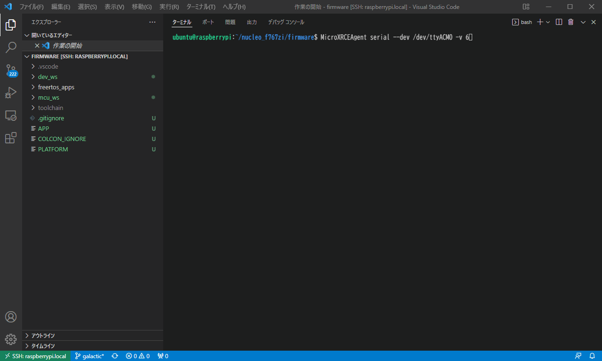

# micro-ROSの調査

## 作業環境

ビルド環境は下記の2種類を試した。

1. WSL2上のUbuntu 20.04でDockerを利用したコンテナ内の環境

    Docker version 20.10.12, build e91ed57

2. Raspberry Pi 3B+にUbuntu 20.04 64bitをインストールした環境

3. PCにUbuntu 22.04 64bitをインストールした環境

エージェントとの通信は、Raspberry Pi

## WSL2上のUbuntuの環境

### ビルド手順

WSL2でのビルド手順を示す。

1. WSLを開き以下のコマンドを実行する

    ```bash
    sudo docker run --name <任意のコンテナ名> -it --net=host --privileged ros:galactic
    ```

2. 作成したコンテナに入る

    ```bash
    docker exec -it ros_build bash
    ```

3. 必要なパッケージをインストールするため、以下のコマンドを実行する。

    ```bash
    apt update
    apt install vim wget cpio
    ```

4. コンパイラをインストールするため、以下のコマンドを実行する。

    ```bash
    mkdir /uros_ws
    cd /uros_ws
    apt update \
        &&  apt install -y wget \
        &&  rm -rf log/ build/ src/* \
        &&  rm -rf /var/lib/apt/lists/* \
        && wget --no-check-certificate https://developer.arm.com/-/media/Files/downloads/gnu-rm/9-2020q2/gcc-arm-none-eabi-9-2020-q2-update-x86_64-linux.tar.bz2 \
        && tar -xvf gcc-arm-none-eabi-9-2020-q2-update-x86_64-linux.tar.bz2 \
        && rm -rf gcc-arm-none-eabi-9-2020-q2-update-x86_64-linux.tar.bz2 gcc-arm-none-eabi-9-2020-q2-update/share/doc \
    ```

5. micro-ROSをインストールするため、以下のコマンドを実行する。

    ```bash
    cd /uros_ws
    git clone -b galactic https://github.com/micro-ROS/micro-ros-build.git src/micro-ros-build \
        &&  . /opt/ros/$ROS_DISTRO/setup.sh \
        &&  apt update \
        &&  apt install -y python3-pip python3-nose clang-format pyflakes3 python3-mypy python3-pytest-mock gperf ros-$ROS_DISTRO-osrf-testing-tools-cpp python3-lttng ros-$ROS_DISTRO-mimick-vendor python3-babeltrace \
        &&  rosdep update --rosdistro $ROS_DISTRO \
        &&  rosdep install --from-paths src --ignore-src -y \
        &&  colcon build \
        &&  . install/local_setup.sh \
        &&  rm -rf log/ build/ src/* \
        &&  rm -rf /var/lib/apt/lists/*
    ```

6. micro_ros_stm32cubemx_utilsをgitからクローンする。以下のコマンドを実行する。

   ```bash
   git clone -b galactic https://github.com/micro-ROS/micro_ros_stm32cubemx_utils.git /project
   ```

7. ビルドに必要な準備を行うため、以下のコマンドを実行する。

    ```bash
    cd /uros_ws
    source /opt/ros/$ROS_DISTRO/setup.bash
    git clone -b $ROS_DISTRO https://github.com/micro-ROS/micro_ros_setup.git src/micro_ros_setup
    rosdep update && rosdep install --from-path src --ignore-src -y
    colcon build
    source install/local_setup.bash
    ```

8. micro-ROSファームウェアの構成を行うため、以下のコマンドを実行する。

    *serialのint32_publisherの場合

    ```bash
    ros2 run micro_ros_setup configure_firmware.sh --transport serial
    ros2 run micro_ros_setup configure_firmware.sh int32_publisher --transport serial
    ```

    *serialのint32_subscriberの場合

    ```bash
    ros2 run micro_ros_setup configure_firmware.sh --transport serial
    ros2 run micro_ros_setup configure_firmware.sh int32_subscriber --transport serial
    ```

9. ビルドを実行する。

    ```bash
    export TOOLCHAIN_PREFIX=/uros_ws/gcc-arm-none-eabi-9-2020-q2-update/bin/arm-none-eabi-
    ros2 run micro_ros_setup build_firmware.sh /project/microros_static_library/library_generation/toolchain.cmake /project/microros_static_library/library_generation/colcon.meta
    ```

10. ビルド結果が`/project/firmware/freertos_apps/microros_nucleo_f767zi_extensions/build`に格納される。

11. デバッグに必要なファイルをコピーするため、以下のコマンドを実行する。

    ```bash
    tar czf firmware.tar.gz firmware/
    ```

12. コンテナからホストにファイルをコピーする。ホスト側で以下のコマンドを実行する

    ```bash
    cd
    sudo docker cp <コンテナ名>:/project/firmware.tar.gz .
    ```

13. ホストからローカルPCにファイルをコピーする。ローカルPCでエクスプローラーを開きパスに`\\wsl$`を入力する。WSLのファイルシステムにアクセスできるのでファイルを任意の場所にコピーする。

### ビルド後のフォルダ構成

|フォルダ名|概要|
|-|-|
|dev_ws|ビルドに必要なツール|
|dev_ws/build|ビルド生成物|
|dev_ws/log|ビルドログ|
|dev_ws/install|コマンドインストール先|
|dev_ws/ament|ROSのビルドツール？|
|dev_ws/ros2|ROS2のビルドツール？|
|freertos_apps|ターゲットデバイス用アプリ|
|mcu_ws/build|ビルド生成物|
|mcu_ws/log|ビルドログ|
|mcu_ws/eProsima|Micro-CDRとMicro-XRCE-DDS-Clientのコード|
|mcu_ws/ros2|ROS2のコード|
|mcu_ws/uros|micro-ROSのコード|
|toolchain|クロスコンパイルに必要なgccツールチェイン|

### Docker内でのビルドをホスト環境での再現の試行

Docker内でビルドした物は、ホストのWindowsにも持ち込めるので、C言語を`make`などを利用した通常の手順で、ビルドすることが出来るが、ROSで使われるメッセージに関するコードは、ビルド途中にC言語が生成される。
このC言語の生成方法を特定できれば、IDEでビルドしたり`make`でビルドしたりと、開発プロジェクトにあった方法を選択できる。

標準のビルド手順では、`colcon`というビルドシステムが使われ、`cmake`や`make`が呼び出され、`ament`というコマンド群が呼び出され、C言語コードの生成が行われている。
ビルド途中に呼び出されるコマンドは、`firmware/dev_ws/install`フォルダにインストールされ、配下には下記のフォルダが生成される。

```text
ament_clang_format, ament_clang_tidy, ament_cmake, ament_cmake_auto, ament_cmake_clang_format, ament_cmake_clang_tidy, ament_cmake_copyright, ament_cmake_core, ament_cmake_cppcheck, ament_cmake_cpplint, ament_cmake_export_definitions, ament_cmake_export_dependencies, ament_cmake_export_include_directories, ament_cmake_export_interfaces, ament_cmake_export_libraries, ament_cmake_export_link_flags, ament_cmake_export_targets, ament_cmake_flake8, ament_cmake_gmock, ament_cmake_google_benchmark, ament_cmake_gtest, ament_cmake_include_directories, ament_cmake_libraries, ament_cmake_lint_cmake, ament_cmake_mypy, ament_cmake_nose, ament_cmake_pclint, ament_cmake_pep257, ament_cmake_pycodestyle, ament_cmake_pyflakes, ament_cmake_pytest, ament_cmake_python, ament_cmake_ros, ament_cmake_target_dependencies, ament_cmake_test, ament_cmake_uncrustify, ament_cmake_version, ament_cmake_xmllint, ament_copyright, ament_cppcheck, ament_cpplint, ament_flake8, ament_index_cpp, ament_index_python, ament_lint, ament_lint_auto, ament_lint_cmake, ament_lint_common, ament_mypy, ament_package, ament_pclint, ament_pep257, ament_pycodestyle, ament_pyflakes, ament_uncrustify, ament_xmllint, domain_coordinator, gmock_vendor, gtest_vendor, uncrustify_vendor
```

上記のように数多くのコマンドが呼ばれ、想像を超える複雑さがあり、ビルド手順の再現には至らなかった。

## Raspberry Piの環境

### Ubuntu 20.04 64bitのインストール

下記のサイトを参考に、Ubuntuをインストールする。
<https://aquasoftware.net/blog/?p=1404>

Ubuntuのイメージは64bit版を使用した。
<https://ubuntu.com/download/raspberry-pi>

### STM32開発環境の構築

下記の手順を参考にSTM32開発閑居をインストールする。

<https://qiita.com/mitazet/items/bfa944c0583b88cf486f>

```bash
sudo apt-get install binutils-arm-none-eabi gcc-arm-none-eabi
sudo apt-get install gdb-arm-none-eabi
sudo apt-get install cmake
sudo apt-get install libusb-1.0
git clone https://github.com/texane/stlink
cd ~/stlink
make
cd build/Release
make
sudo make install
```

### ROS開発環境の構築

1. ロケールを設定するため、以下のコマンドを実行する。

    ```bash
    sudo apt update && sudo apt install locales
    sudo locale-gen en_US en_US.UTF-8
    sudo update-locale LC_ALL=en_US.UTF-8 LANG=en_US.UTF-8
    export LANG=en_US.UTF-8
    ```

2. GPGキーを設定する。以下のコマンドを実行する

    ```bash
    sudo apt update && sudo apt install curl gnupg2 lsb-release
    sudo curl -sSL https://raw.githubusercontent.com/ros/rosdistro/master/ros.key -o /usr/share/keyrings/ros-archive-keyring.gpg
    ```

3. リポジトリをソースリストに追加する。以下のコマンドを実行する

    ```bash
    sudo echo "deb [arch=$(dpkg --print-architecture) signed-by=/usr/share/keyrings/ros-archive-keyring.gpg] http://packages.ros.org/ros2/ubuntu $(source /etc/os-release && echo $UBUNTU_CODENAME) main" | sudo tee /etc/apt/sources.list.d/ros2.list > /dev/null
    ```

4. ROS2パッケージをインストールする。以下のコマンドを実行する

    ```bash
    sudo apt update
    sudo apt install ros-galactic-ros-base gcc-arm-none-eabi
    ```

    ```bash
    source /opt/ros/galactic/setup.bash
    ```

5. micro-ROSをインストールするため、以下のコマンドを実行する。

    ```bash
    git clone -b galactic https://github.com/micro-ROS/micro-ros-build.git src/micro-ros-build
    . /opt/ros/$ROS_DISTRO/setup.sh
    sudo apt update
    sudo apt install -y python3-pip python3-nose clang-format pyflakes3 python3-mypy python3-pytest-mock gperf ros-$ROS_DISTRO-osrf-testing-tools-cpp python3-lttng ros-$ROS_DISTRO-mimick-vendor python3-babeltrace
    export CROSS_COMPILE=/usr/bin/arm-none-eabi-
    export TOOLCHAIN_PREFIX=/usr/bin/arm-none-eabi-
    rosdep update --rosdistro $ROS_DISTRO
    rosdep install --from-paths src --ignore-src -y
    colcon build
    . install/local_setup.sh
    #rm -rf log/ build/ src/*
    #rm -rf /var/lib/apt/lists/*
    ```

6. micro_ros_stm32cubemx_utilsをgitからクローンする。以下のコマンドを実行する。

   ```bash
   git clone -b galactic https://github.com/micro-ROS/micro_ros_stm32cubemx_utils.git /project
   ```

7. ビルドに必要な準備を行うため、以下のコマンドを実行する。

    ```bash
    mkdir ~/uros_ws
    cd ~/uros_ws
    source /opt/ros/$ROS_DISTRO/setup.bash
    git clone -b $ROS_DISTRO https://github.com/micro-ROS/micro_ros_setup.git src/micro_ros_setup
    rosdep update && rosdep install --from-path src --ignore-src -y
    colcon build
    source install/local_setup.bash
    ```

8. micro-ROSファームウェアの構成を行うため、以下のコマンドを実行する。

    ```bash
    mkdir ~/nucleo_f767zi
    cd ~/nucleo_f767zi
    ```

    *serialのint32_publisherの場合

    ```bash
    ros2 run micro_ros_setup configure_firmware.sh --transport serial
    ros2 run micro_ros_setup configure_firmware.sh int32_publisher --transport serial
    ```

    *serialのint32_subscriberの場合

    ```bash
    ros2 run micro_ros_setup configure_firmware.sh --transport serial
    ros2 run micro_ros_setup configure_firmware.sh int32_subscriber --transport serial
    ```

9. ビルドを実行する。

    ```bash
    export TOOLCHAIN_PREFIX=/usr/bin/arm-none-eabi-
    ros2 run micro_ros_setup build_firmware.sh /project/microros_static_library/library_generation/toolchain.cmake /project/microros_static_library/library_generation/colcon.meta
    ```

    ビルドは失敗してしまうので、下記の手順が必要。
    シリアルはビルドが完了したが、TCPとUDPに関してはビルドできなかった。READMEにもSTM32-F767ZIはUARTのみの対応となっているので、ビルドは出来ないと判断した。

### toolchainの変更

micro-ROSの環境構築中にダウンロードされる`toolchain`の`arm-none-eabi-gcc`はx86-64のlinux向けバイナリのようで、Raspberry Piでは使えない。

そこで、`freertos_apps/microros_nucleo_f767zi_extensions/arm_toolchain.cmake.in`の下記の部分を変更する。

```cmake
set(CMAKE_C_COMPILER @CROSS_COMPILE@gcc)
set(CMAKE_CXX_COMPILER @CROSS_COMPILE@g++)
```

上記をを下記のように変更し、

```cmake
set(CMAKE_C_COMPILER arm-none-eabi-gcc)
set(CMAKE_CXX_COMPILER arm-none-eabi-g++)
```

自動的にダウンロードされたtoolchainではなく、システムにインストールした物を使用する。

### リンクエラーの解消

リンク時に、`__aeabi_read_tp`関数の定義が無いとエラーになったので、下記の対策を行う。
`freertos_apps/microros_nucleo_f767zi_extensions/startup_stm32f767xx.s`ファイルの最後に`__aeabi_read_tp`関数を追加。

```arm
   .hidden __aeabi_read_tp
__aeabi_read_tp:
   mrc        p15, 0, r0, c13, c0, 3
   bx         lr
```

## Ubuntu 22.04 の環境

### STM32開発環境の構築

下記の手順を参考にSTM32開発環境をインストールする。

<https://qiita.com/mitazet/items/bfa944c0583b88cf486f>

```bash
sudo apt -y install gcc-arm-none-eabi gdb-arm-none-eabi cmake libusb-1.0
git clone https://github.com/texane/stlink
cd ~/stlink
make
cd build/Release
make
sudo make install
```

### ROS開発環境の構築

0. 前準備 : ビルドを高速化するために以下を設定．NUMには並列コンパイルの数を記載する．

    ```bash
    export MAKEFLAGS="-j NUM"    
    ```

1. ロケールを設定するため、以下のコマンドを実行する。

    ```bash
    sudo apt update && sudo apt -y install locales
    sudo locale-gen en_US en_US.UTF-8
    sudo update-locale LC_ALL=en_US.UTF-8 LANG=en_US.UTF-8
    export LANG=en_US.UTF-8
    ```

2. GPGキーを設定する。以下のコマンドを実行する

    ```bash
    sudo apt update && sudo apt -y install curl gnupg2 lsb-release
    sudo curl -sSL https://raw.githubusercontent.com/ros/rosdistro/master/ros.key -o /usr/share/keyrings/ros-archive-keyring.gpg
    ```

3. リポジトリをソースリストに追加する。以下のコマンドを実行する

    ```bash
    sudo echo "deb [arch=$(dpkg --print-architecture) signed-by=/usr/share/keyrings/ros-archive-keyring.gpg] http://packages.ros.org/ros2/ubuntu $(source /etc/os-release && echo $UBUNTU_CODENAME) main" | sudo tee /etc/apt/sources.list.d/ros2.list > /dev/null
    ```

4. ROS2パッケージをインストールする。以下のコマンドを実行する

    ```bash
    sudo apt update; sudo apt -y install ros-humble-ros-base
    ```

    ```bash
    source /opt/ros/humble/setup.bash
    ```

5. micro-ROSをインストールするため、以下のコマンドを実行する。

    ```bash
    sudo apt update
    sudo apt install -y python3-pip python3-nose clang-format pyflakes3 python3-mypy python3-pytest-mock gperf ros-$ROS_DISTRO-osrf-testing-tools-cpp python3-lttng ros-$ROS_DISTRO-mimick-vendor python3-babeltrace python3-rosdep2 python3-colcon-common-extensions
    export CROSS_COMPILE=/usr/bin/arm-none-eabi-
    export TOOLCHAIN_PREFIX=/usr/bin/arm-none-eabi-
    ```

6. ビルドに必要な準備を行うため、以下のコマンドを実行する。

    ```bash
    mkdir uros_ws
    cd uros_ws    
    git clone -b $ROS_DISTRO https://github.com/micro-ROS/micro_ros_setup.git src/micro_ros_setup
    rosdep update && rosdep install --from-path src --ignore-src -y
    colcon build
    source install/local_setup.bash
    cd ..
    ```

7. micro_ros_stm32cubemx_utilsをgitからクローンする。以下のコマンドを実行する。

   ```bash
   git clone -b $ROS_DISTRO https://github.com/micro-ROS/micro_ros_stm32cubemx_utils.git
   ```

8. micro-ROSファームウェアの構成を行うため、以下のコマンドを実行する。

    ARMのコンパイラをダウンロードするため時間を要する．

    ```bash
    mkdir nucleo_f767zi
    cd nucleo_f767zi
    ros2 run micro_ros_setup create_firmware_ws.sh  freertos nucleo_f767zi
    ```

    *serialのint32_publisherの場合

    ```bash
    ros2 run micro_ros_setup configure_firmware.sh int32_publisher --transport serial
    ```

    *serialのint32_subscriberの場合

    ```bash
    ros2 run micro_ros_setup configure_firmware.sh int32_subscriber --transport serial
    ```

9. ビルドを実行する。

    ```bash
    ros2 run micro_ros_setup build_firmware.sh ../micro_ros_stm32cubemx_utils/library_generation/toolchain.cmake ./micro_ros_stm32cubemx_utils/library_generation/colcon.meta
    ```

10. ターゲットへの書き込み

    ```bash
    sudo st-flash write ./firmware/freertos_apps/microros_nucleo_f767zi_extensions/build/micro-ROS.bin  0x8000000
    ```

### 再ビルドの手順

1. 環境変数を設定

    ```bash
    source /opt/ros/humble/setup.bash
    source ~/uros_ws/install/local_setup.bash
    ```

## 変更したアプリのビルド

上記の変更の後[ROS開発環境の構築](#ROS開発環境の構築)の8と9の手順を行うと、ビルドが完了する。
`libmicroros.a`の作成が出来れば、アプリ部分のビルドはMakefileになっているので`make`コマンドでビルド可能。
`int32_publisher`を元にデータ長を256Byteにした`int32multiarray_publisher`を作成。
環境変数の`UROS_APP_FOLDER`を設定して`make`コマンドでビルド出来ることを確認した。

```bash
cd freertos_apps/microros_nucleo_f767zi_extensions
export UROS_APP_FOLDER=../apps/int32multiarray_publisher
make
```

## エージェントとの通信

1. エージェントのビルド

    `Micro-XRCE-DDS-Agent`はLinuxのみでシリアル通信をサポートしているので、Raspberry Piでビルドした。

    下記の記事を参考にで`Micro-XRCE-DDS-Agent`をビルドする。
    <https://qiita.com/lutecia16v/items/5760551dd3a7a0d3e7d3>

2. `Micro-XRCE-DDS-Agent`のコードをクローン

    ``` bash
    cd ~
    git clone https://github.com/eProsima/Micro-XRCE-DDS-Agent.git
    ```

3. ビルド

    ```bash
    cd Micro-XRCE-DDS-Agent
    mkdir build && cd build
    cmake -DTHIRDPARTY=ON ..
    make
    sudo make install
    sudo ldconfig /usr/local/lib/
    ```

4. 実行

    `verbose_level`を6に設定して、メッセージの受信を表示するようにします。

    ```bash
    MicroXRCEAgent serial --dev /dev/ttyACM0 -v 6
    ```

    実行結果（データ256Byte、100ms間隔）

    

## WSL2のシリアル通信

WSLの標準のUbuntuでは、Windowsで認識したシリアルポートでも使うことができない。
Ubuntuのカーネルをコンパイルし差し替えることで、シリアルが使えるようになる。

- 参考URL

    <https://ascii.jp/elem/000/004/082/4082673/>
    <https://github.com/dorssel/usbipd-win/wiki/WSL-support>

また、WSLにUSB デバイスを接続する方法を行うことで、STM32のST-LinkのUSBシリアルと通信することが出来る。

- 参考URL

    <https://docs.microsoft.com/ja-jp/windows/wsl/connect-usb>

WSL2のUbuntuでAgentを実行し、10分以上通信できることを確認した。
