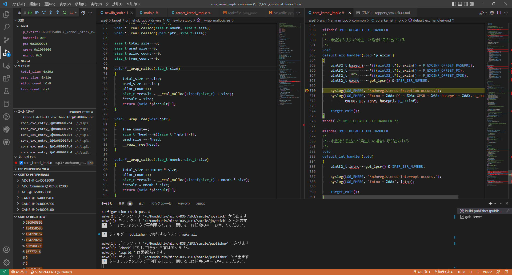
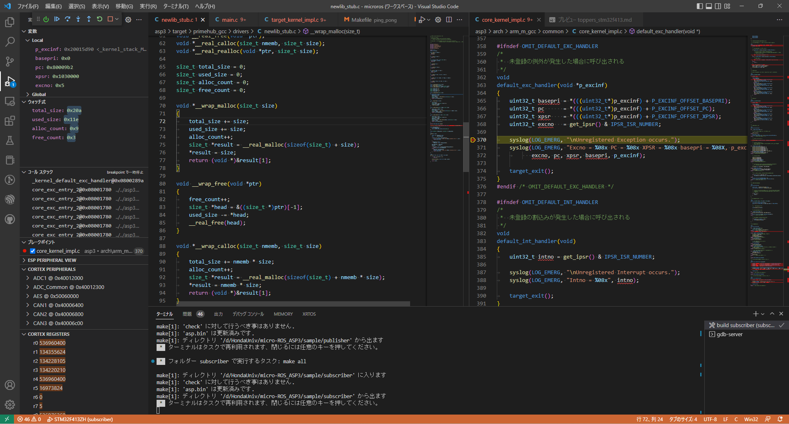
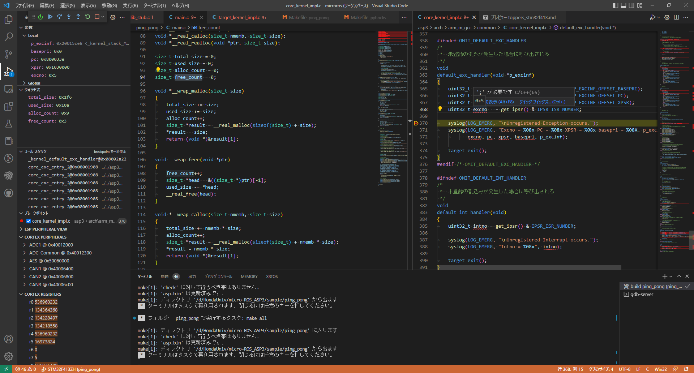

# メモリ使用量の調査

## malloc/freeのwrap

ヒープメモリ取得解放関数について、gcc/ldのオプション`-wrap`を使用し`malloc`と`free`、`calloc`、`realloc`に付いてラッパーを作成し、取得サイズと取得回数、解放回数をカウントするラッパー関数を作成した。

`Makefile`では、下記のように`-wrap`で`malloc`などを指定した。

```makefile
#
#  全体のリンク
#
$(OBJFILE): $(ALL_OBJS) $(LIBS_DEP)
  $(LINK) $(CFLAGS) $(LDFLAGS) $(OBJ_LDFLAGS) -o $(OBJFILE) \
    -Wl,-Map=$(OBJNAME).map,--cref -Wl,-wrap,malloc,-wrap,calloc,-wrap,realloc,-wrap,free \
    $(START_OBJS) $(APPL_OBJS) $(SYSSVC_OBJS) $(CFG_OBJS) \
    -Wl,--start-group $(ALL_LIBS) -Wl,--end-group $(END_OBJS)
```

`newlib_stub.c`にラッパー関数を作成し、下記のように実装した。

```c
void *__real_malloc(size_t size);
void __real_free(void *ptr);
void *__real_calloc(size_t nmemb, size_t size);
void *__real_realloc(void *ptr, size_t size);

size_t total_size = 0;
size_t used_size = 0;
size_t alloc_count = 0;
size_t free_count = 0;

void *__wrap_malloc(size_t size)
{
  total_size += size;
  used_size += size;
  alloc_count++;
  size_t *result = __real_malloc(sizeof(size_t) + size);
  *result = size;
  return (void *)&result[1];
}

void __wrap_free(void *ptr)
{
  free_count++;
  size_t *head = &((size_t *)ptr)[-1];
  used_size -= *head;
  __real_free(head);
}

void *__wrap_calloc(size_t nmemb, size_t size)
{
  total_size += nmemb * size;
  alloc_count++;
  size_t *result = __real_malloc(sizeof(size_t) + nmemb * size);
  *result = nmemb * size;
  return (void *)&result[1];
}

void *__wrap_realloc(void *ptr, size_t size)
{
  total_size += size;
  size_t *head = &((size_t *)ptr)[-1];
  used_size -= *head;
  used_size += size;
  size_t *result = __real_realloc(head, sizeof(size_t) + size);
  *result = size;
  return (void *)&result[1];
}
```

ラッパー関数ではグローバル変数にメモリ取得の回数やサイズを保存し、下記の内容となっている。

|グローバル変数|概要|
|-|-|
|total_size|メモリ取得を行った累計サイズ|
|used_size|取得された使用中のメモリサイズ|
|alloc_count|メモリ取得を行った回数|
|free_count|メモリ解放を行った回数|

Argentと通信を始め安定したところで一時停止し、デバッガーで各グローバル変数の値を調査した。

## Publisher



一時停止時のグローバル変数の値は以下の通り。

|グローバル変数|値|
|-|-|
|total_size|522(0x20a)Byte|
|used_size|286(0x11e)Byte|
|alloc_count|9回|
|free_count|3回|

## Subscriber



一時停止時のグローバル変数の値は以下の通り。

|グローバル変数|値|
|-|-|
|total_size|522(0x20a)Byte|
|used_size|286(0x11e)Byte|
|alloc_count|9回|
|free_count|3回|

## Ping Pong



一時停止時のグローバル変数の値は以下の通り。

|グローバル変数|値|
|-|-|
|total_size|502(0x1f6)Byte|
|used_size|266(0x10a)Byte|
|alloc_count|9回|
|free_count|3回|

## メモリ使用量について

初期化時にヒープメモリを取得するが、通信時にはヒープメモリは使用していない。
`app-colcon.meta`に指定している`RMW_UXRCE_MAX_NODES`や`RMW_UXRCE_MAX_PUBLISHERS`、`RMW_UXRCE_MAX_SUBSCRIPTIONS`の値は下記の通り。

|マクロ|Publisher|Subscriber|Ping Pong|
|-|-|-|-|
|RMW_UXRCE_MAX_NODES|1|1|1|
|RMW_UXRCE_MAX_PUBLISHERS|1|0|2|
|RMW_UXRCE_MAX_SUBSCRIPTIONS|0|1|2|

これらのマクロはグローバル変数のサイズに影響するが、ヒープメモリからの取得は行っていない。

mcu_ws/uros/rmw_microxrcedds/rmw_microxrcedds_c/src/types.c

```c
rmw_uxrce_mempool_t node_memory;
rmw_uxrce_node_t custom_nodes[RMW_UXRCE_MAX_NODES];

rmw_uxrce_mempool_t publisher_memory;
rmw_uxrce_publisher_t custom_publishers[RMW_UXRCE_MAX_PUBLISHERS];

rmw_uxrce_mempool_t subscription_memory;
rmw_uxrce_subscription_t custom_subscriptions[RMW_UXRCE_MAX_SUBSCRIPTIONS];
```

mcu_ws/uros/rmw_microxrcedds/rmw_microxrcedds_c/src/memory.c

`rmw_init_options_init`関数で呼び出している`get_memory`関数は、
`RMW_UXRCE_ALLOW_DYNAMIC_ALLOCATIONS`マクロが有効な場合、ヒープメモリから取得するが、上記のアプリでは有効にしていない。マクロ定義以上にトピックをPublishやSubscribすると`has_memory`が`false`で返すので、メモリ取得に失敗する。

## メモリ取得解放呼び出しのコールスタック

Subscriberでメモリ取得解放呼び出しのコールスタックを確認した。

### 1回目

mcu_ws/uros/rclc/rclc/src/rclc/init.c:
rclc_support_init ->
mcu_ws/uros/rcl/rcl/src/rcl/init_options.c:
rcl_init_options_init ->
mcu_ws/uros/rcl/rcl/src/rcl/init_options.c:
_rcl_init_options_zero_init ->
mcu_ws/uros/rcutils/src/allocator.c:
allocator.allocate(__default_allocate) -> malloc

### 2回目

mcu_ws/uros/rclc/rclc/src/rclc/init.c:
rclc_support_init ->
mcu_ws/uros/rclc/rclc/src/rclc/init.c:
rclc_support_init_with_options ->
mcu_ws/ros2/rcl/rcl/src/rcl/init.c:
rcl_init ->
mcu_ws/uros/rcutils/src/allocator.c:
allocator.zero_allocate(__default_zero_allocate) -> calloc

### 3回目

mcu_ws/uros/rclc/rclc/src/rclc/init.c:
rclc_support_init ->
mcu_ws/uros/rclc/rclc/src/rclc/init.c:
rclc_support_init_with_options ->
mcu_ws/ros2/rcl/rcl/src/rcl/init.c:
rcl_init ->
mcu_ws/uros/rcl/rcl/src/rcl/init_options.c:
rcl_init_options_copy ->
mcu_ws/uros/rcl/rcl/src/rcl/init_options.c:
_rcl_init_options_zero_init ->
mcu_ws/uros/rcutils/src/allocator.c:
allocator.allocate(__default_allocate) -> malloc

### 4回目

mcu_ws/uros/rclc/rclc/src/rclc/node.c:
rclc_node_init_default ->
mcu_ws/uros/rclc/rclc/src/rclc/node.c:
rcl_node_get_default_options ->
mcu_ws/ros2/rcl/rcl/src/rcl/node.c:
rcl_node_init ->
mcu_ws/uros/rcutils/src/allocator.c:
allocator->allocate(__default_allocate) -> malloc

### 5回目

mcu_ws/uros/rclc/rclc/src/rclc/node.c:
rclc_node_init_default ->
mcu_ws/uros/rclc/rclc/src/rclc/node.c:
rcl_node_get_default_options ->
mcu_ws/ros2/rcl/rcl/src/rcl/node.c:
rcl_node_init ->
mcu_ws/uros/rcutils/src/format_string.c:
rcutils_format_string(rcutils_format_string_limit) ->
mcu_ws/uros/rcutils/src/allocator.c:
allocator->allocate(__default_allocate) -> malloc

### 6回目

mcu_ws/uros/rclc/rclc/src/rclc/node.c:
rclc_node_init_default ->
mcu_ws/uros/rclc/rclc/src/rclc/node.c:
rcl_node_get_default_options ->
mcu_ws/ros2/rcl/rcl/src/rcl/node.c:
rcl_node_init ->
mcu_ws/uros/rcutils/src/allocator.c:
allocator->allocate(__default_allocate) -> malloc

### 7回目

mcu_ws/uros/rclc/rclc/src/rclc/node.c:
rclc_node_init_default ->
mcu_ws/uros/rclc/rclc/src/rclc/node.c:
rcl_node_get_default_options ->
mcu_ws/ros2/rcl/rcl/src/rcl/node.c:
rcl_node_init ->
mcu_ws/ros2/rcl/rcl/src/rcl/guard_condition.c:
rcl_guard_condition_init_from_rmw ->
mcu_ws/ros2/rcl/rcl/src/rcl/guard_condition.c:
__rcl_guard_condition_init_from_rmw_impl ->
mcu_ws/uros/rcutils/src/allocator.c:
allocator->allocate(__default_allocate) -> malloc

### 8回目

mcu_ws/uros/rclc/rclc/src/rclc/subscription.c:
rclc_subscription_init_default ->
mcu_ws/uros/rclc/rclc/src/rclc/subscription.c:
rclc_subscription_init ->
mcu_ws/ros2/rcl/rcl/src/rcl/subscription.c:
rcl_subscription_init ->
mcu_ws/ros2/rcl/rcl/src/rcl/node_resolve_name.c:
rcl_node_resolve_name ->
mcu_ws/ros2/rcl/rcl/src/rcl/node_resolve_name.c:
rcl_resolve_name ->
mcu_ws/uros/rcutils/src/string_map.c:
rcutils_string_map_init ->
mcu_ws/uros/rcutils/src/allocator.c:
allocator->allocate(__default_allocate) -> malloc

### 9回目

mcu_ws/uros/rclc/rclc/src/rclc/subscription.c:
rclc_subscription_init_default ->
mcu_ws/uros/rclc/rclc/src/rclc/subscription.c:
rclc_subscription_init ->
mcu_ws/ros2/rcl/rcl/src/rcl/subscription.c:
rcl_subscription_init ->
mcu_ws/ros2/rcl/rcl/src/rcl/node_resolve_name.c:
rcl_node_resolve_name ->
mcu_ws/ros2/rcl/rcl/src/rcl/node_resolve_name.c:
rcl_resolve_name ->
mcu_ws/uros/rcl/rcl/src/rcl/expand_topic_name.c:
rcl_expand_topic_name ->
mcu_ws/uros/rcutils/src/strdup.c:
rcutils_strdup ->
mcu_ws/uros/rcutils/src/strdup.c:
rcutils_strndup ->

## 気になるオプション

`UCLIENT_PROFILE_MULTITHREAD`は、`mcu_ws\eProsima\Micro-XRCE-DDS-Client\include\uxr\client\profile\multithread\multithread.h`で定義される`UXR_LOCK`、`UXR_UNLOCK`などのミューテックスが有効になる。
